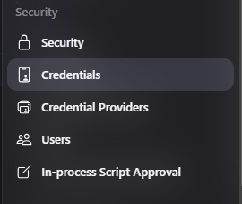
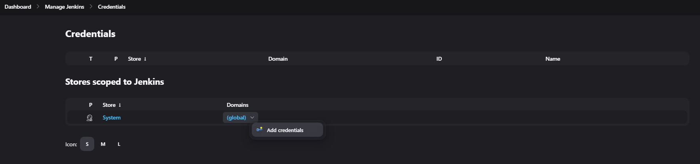
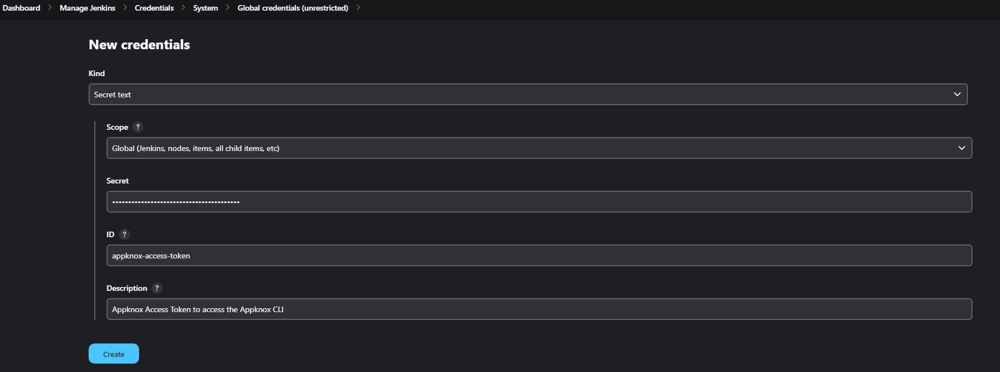
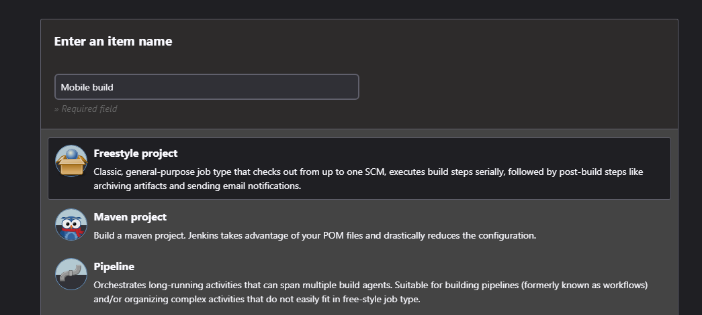
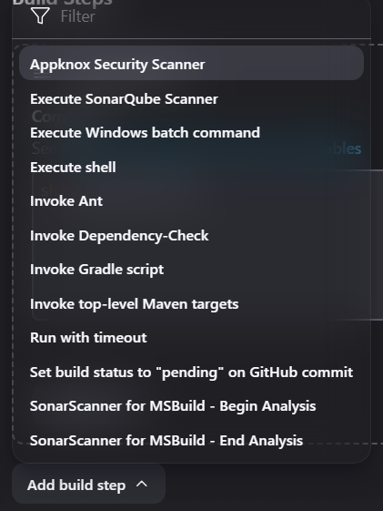
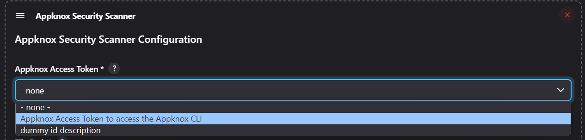
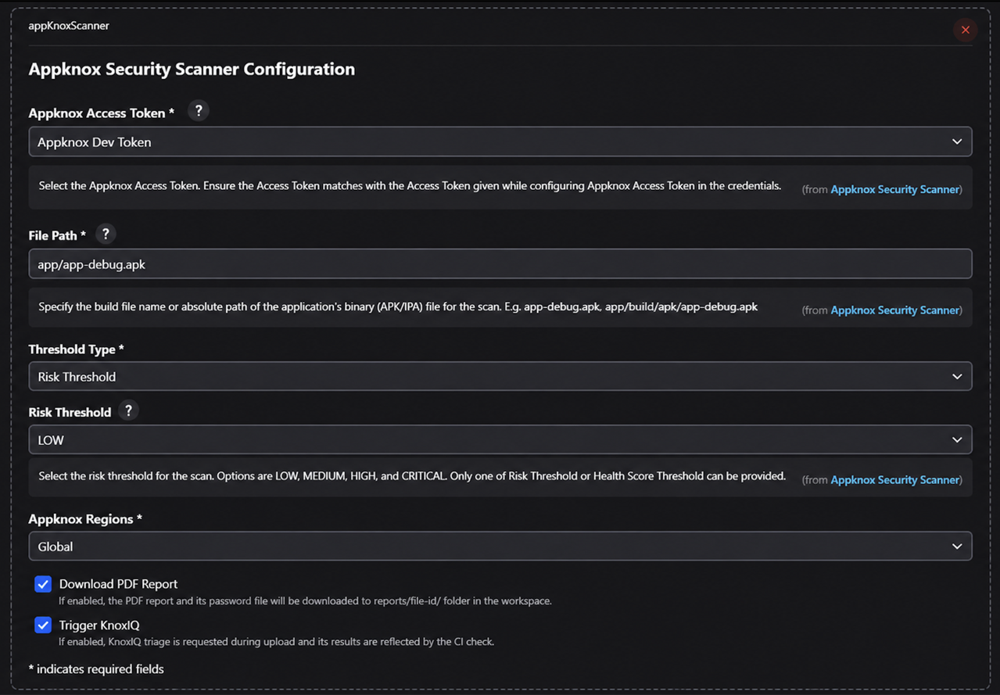
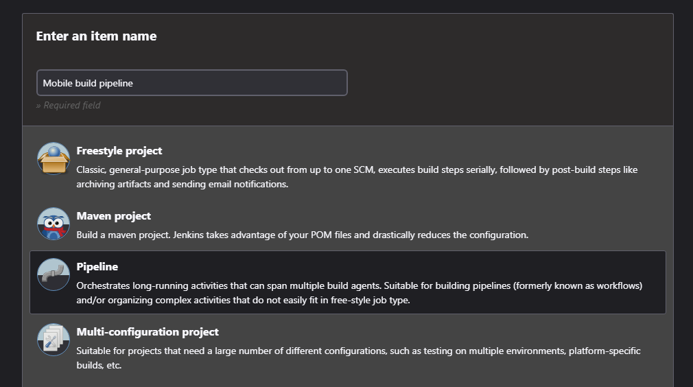
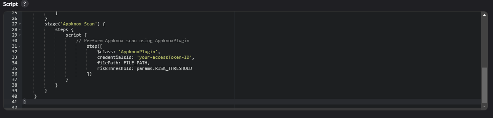

# Appknox Security Scan Plugin

The Appknox Security Scan Plugin allows you to perform Appknox security scan on your mobile application binary. The APK/IPA built from your CI pipeline will be uploaded to Appknox platform which performs static scan and the build will be errored according to the chosen risk threshold, minimum health score, or KnoxIQ exploit likelihood.

## How to use it?

### Step 1: Get your Appknox Access Token

Sign up on [Appknox](https://appknox.com).

Generate a personal access token from <a href="https://secure.appknox.com/settings/developersettings" target="_blank">Developer Settings</a>

### Step 2: Store Appknox Access Token in Credentials

Select credentials options from Manage Jenkins -> Credentials:



Store Appknox Access Token as Global Credential:



Select Kind as "Secret Text" and store the Appknox Access Token with desired "ID" and "Description":



## Appknox Plugin as Jenkins Job

### Step 1: Define Job Name

Add job name and select Freestyle project:



### Step 2: Add Appknox Plugin

Add Appknox Plugin from build step:



### Step 3: Configure Appknox Plugin

Select Access Token from the dropdown:



#### Note:

Ensure the Access Token matches with the Access Token given while configuring Appknox Access Token in the credentials.

Add other details in the Appknox Plugin Configuration:




## Appknox Plugin as Pipeline

### Step 1: Define Pipeline Name

Add Pipeline name and select Pipeline project:



### Step 2: Appknox Plugin Pipeline Script

Add Appknox Plugin Stage:



#### Note:

Ensure the Appknox Access Token ID matches with the ID given while configuring Appknox Access Token in the credentials.

#### In your Pipeline Stages Add this after building your Application stage:-

```groovy
stages {
    stage('Appknox Scan') {
        steps {
            script {
                appKnoxScanner(
                    credentialsId: 'your-appknox-access-token-ID', // Specify the Appknox Access Token ID that was set when storing the token in Jenkins credentials.
                    filePath: FILE_PATH,
                    thresholdType: 'RISK', // 'RISK', 'HEALTH_SCORE', or 'EXPLOIT_LIKELIHOOD' -- pick exactly one, with the matching threshold field below
                    riskThreshold: params.RISK_THRESHOLD, // required when thresholdType is 'RISK'
                    // healthScoreThreshold: params.HEALTH_SCORE_THRESHOLD, // required when thresholdType is 'HEALTH_SCORE' instead
                    // exploitLikelihoodThreshold: params.EXPLOIT_LIKELIHOOD_THRESHOLD, // required when thresholdType is 'EXPLOIT_LIKELIHOOD' instead -- automatically requests KnoxIQ triage regardless of triggerKnoxiq below
                    region: params.REGION,
                    generatePdfReport: params.GENERATE_PDF, // set to true to download a password-protected PDF report
                    triggerKnoxiq: params.TRIGGER_KNOXIQ // set to true to request KnoxIQ triage during upload
                )
            }
        }
    }
}
```

## Inputs

| Key                 | Value                        |
|---------------------|------------------------------|
| `credentialsId`     | Personal appknox access token ID |
| `filePath`          | Specify the build file name or path for the mobile application binary to upload, E.g. app-debug.apk, app/build/apk/app-debug.apk |
| `thresholdType`     | Which threshold to enforce — pick exactly one. <br><br>Accepted values: `RISK`, `HEALTH_SCORE`, `EXPLOIT_LIKELIHOOD` |
| `riskThreshold`     | Risk threshold value for which the CI should fail. Required when `thresholdType` is `RISK`. <br><br>Accepted values: `CRITICAL, HIGH, MEDIUM & LOW` <br><br>Default: `LOW` |
| `healthScoreThreshold` | Minimum health score (0-100) the scanned app must meet for the CI to pass. Required when `thresholdType` is `HEALTH_SCORE`. |
| `exploitLikelihoodThreshold` | Minimum KnoxIQ exploit-likelihood level for which the CI should fail, based on real-world exploitability rather than raw CVSS severity. Required when `thresholdType` is `EXPLOIT_LIKELIHOOD`. Automatically requests KnoxIQ triage during upload regardless of `triggerKnoxiq` — this gate only works against triaged results. <br><br>Accepted values: `LOW, MEDIUM, HIGH` |
| `region`            | Specify the Appknox region. <br><br>Accepted values: `global`, `uae`, `saudi` <br><br>Default: `global` |
| `generatePdfReport` | (Optional) Download a PDF VAPT report after the scan. The report is password-protected. <br><br>Accepted values: `true`, `false` <br><br>Default: `false` |
| `triggerKnoxiq`     | (Optional) Request KnoxIQ triage for this build during upload; results are reflected by the CI check. Forced on automatically when `thresholdType` is `EXPLOIT_LIKELIHOOD`. <br><br>Accepted values: `true`, `false` <br><br>Default: `false` |

---

## Example Script:

### Example — Risk Threshold
```groovy
pipeline {
    agent any
    parameters {
        choice(name: 'RISK_THRESHOLD', choices: ['LOW', 'MEDIUM', 'HIGH', 'CRITICAL'], description: 'Risk Threshold')
        choice(name: 'REGION', choices: ['global', 'uae', 'saudi'], description: 'Appknox Region')
        booleanParam(name: 'GENERATE_PDF', defaultValue: false, description: 'Download PDF report')
        booleanParam(name: 'TRIGGER_KNOXIQ', defaultValue: false, description: 'Request KnoxIQ triage during upload')
    }
    stages {
        stage('Checkout') {
            steps {
                git 'https://github.com/yourgithub/reponame'
            }
        }
        stage('Build App') {
            steps {
                // Build the app using your build tool. Example uses Gradle.
                script {
                    sh './gradlew build'
                    FILE_PATH = "app/build/outputs/apk/debug/app-debug.apk"
                }
            }
        }
        stage('Appknox Scan') {
            steps {
                script {
                    appKnoxScanner(
                        credentialsId: 'your-appknox-access-token-ID', // Specify the Appknox Access Token ID that was set when storing the token in Jenkins credentials.
                        filePath: FILE_PATH,
                        thresholdType: 'RISK',
                        riskThreshold: params.RISK_THRESHOLD,
                        region: params.REGION,
                        generatePdfReport: params.GENERATE_PDF, // set to true to download a password-protected PDF report
                        triggerKnoxiq: params.TRIGGER_KNOXIQ // set to true to request KnoxIQ triage during upload
                    )
                }
            }
        }
    }
}
```

### Example — Health Score Threshold
```groovy
pipeline {
    agent any
    parameters {
        string(name: 'HEALTH_SCORE_THRESHOLD', defaultValue: '70', description: 'Minimum Health Score (0-100)')
        choice(name: 'REGION', choices: ['global', 'uae', 'saudi'], description: 'Appknox Region')
        booleanParam(name: 'GENERATE_PDF', defaultValue: false, description: 'Download PDF report')
        booleanParam(name: 'TRIGGER_KNOXIQ', defaultValue: false, description: 'Request KnoxIQ triage during upload')
    }
    stages {
        stage('Checkout') {
            steps {
                git 'https://github.com/yourgithub/reponame'
            }
        }
        stage('Build App') {
            steps {
                // Build the app using your build tool. Example uses Gradle.
                script {
                    sh './gradlew build'
                    FILE_PATH = "app/build/outputs/apk/debug/app-debug.apk"
                }
            }
        }
        stage('Appknox Scan') {
            steps {
                script {
                    appKnoxScanner(
                        credentialsId: 'your-appknox-access-token-ID', // Specify the Appknox Access Token ID that was set when storing the token in Jenkins credentials.
                        filePath: FILE_PATH,
                        thresholdType: 'HEALTH_SCORE',
                        healthScoreThreshold: params.HEALTH_SCORE_THRESHOLD,
                        region: params.REGION,
                        generatePdfReport: params.GENERATE_PDF, // set to true to download a password-protected PDF report
                        triggerKnoxiq: params.TRIGGER_KNOXIQ // set to true to request KnoxIQ triage during upload
                    )
                }
            }
        }
    }
}
```

### Example — Exploit Likelihood Threshold
```groovy
pipeline {
    agent any
    parameters {
        choice(name: 'EXPLOIT_LIKELIHOOD_THRESHOLD', choices: ['LOW', 'MEDIUM', 'HIGH'], description: 'Minimum Exploit Likelihood')
        choice(name: 'REGION', choices: ['global', 'uae', 'saudi'], description: 'Appknox Region')
        booleanParam(name: 'GENERATE_PDF', defaultValue: false, description: 'Download PDF report')
    }
    stages {
        stage('Checkout') {
            steps {
                git 'https://github.com/yourgithub/reponame'
            }
        }
        stage('Build App') {
            steps {
                // Build the app using your build tool. Example uses Gradle.
                script {
                    sh './gradlew build'
                    FILE_PATH = "app/build/outputs/apk/debug/app-debug.apk"
                }
            }
        }
        stage('Appknox Scan') {
            steps {
                script {
                    appKnoxScanner(
                        credentialsId: 'your-appknox-access-token-ID', // Specify the Appknox Access Token ID that was set when storing the token in Jenkins credentials.
                        filePath: FILE_PATH,
                        thresholdType: 'EXPLOIT_LIKELIHOOD',
                        exploitLikelihoodThreshold: params.EXPLOIT_LIKELIHOOD_THRESHOLD,
                        region: params.REGION,
                        generatePdfReport: params.GENERATE_PDF // set to true to download a password-protected PDF report
                        // triggerKnoxiq is not set here -- it's forced on automatically for this threshold type
                    )
                }
            }
        }
    }
}
```

**Note:** `exploitLikelihoodThreshold` gates on KnoxIQ's real-world exploitability assessment instead of raw CVSS risk. It requires KnoxIQ triage to complete for the uploaded file, so `--knoxiq` is always passed on upload when this threshold type is selected -- the `triggerKnoxiq` input is ignored (and disabled in the classic UI) in this mode. If KnoxIQ triage is unavailable or does not complete in time, the CLI falls back to a risk check at `LOW` -- any Low-or-higher finding fails the build, regardless of which Exploit Likelihood level was configured. See the console output for which gate actually ran.
